# **Docker image**

We publish two docker images on docker hub. The size of the images are about 14.7GB.
For Unifuzz and 12-real-world binaries, we build a docker image on top of ubuntu16.04 X86.
For CGC dataset, we build a docker image on top of ubuntu16.04 i386.

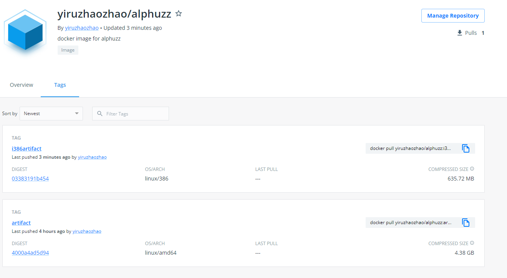

## ** docker image X86**

```bash
$ sudo docker pull yiruzhaozhao/alphuzz:artifact

$ sudo docker run --privileged -it yiruzhaozhao/alphuzz:artifact /bin/bash
```

We put the datasets binaries and initial seeds under the root directory.

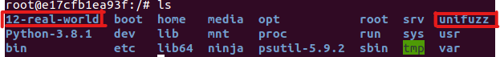


We put the Alphuzz and Alpuzzplusplus under the */home* directory. 

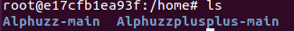


## **Example**
Take Unifuzz dataset for example.

### **Alphuzz**

```bash
$ /home/Alphuzz-main/afl-fuzz -i /unifuzz/seeds/exiv2 -o /home/out -Q -- /unifuzz/binaries/exiv2 @@ 
```
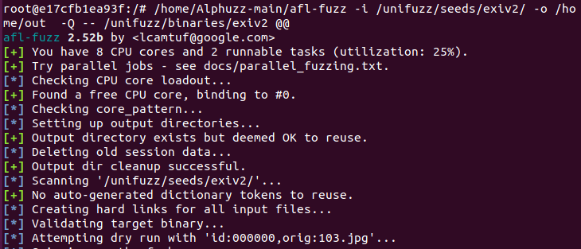
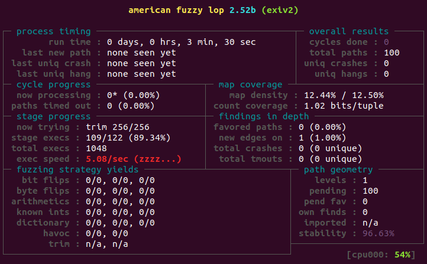


### **Alphuzzplusplus**
```bash
$ /home/Alphuzzplusplus-main/afl-fuzz -i /unifuzz/seeds/cflow -o /home/out -Q -t 3000+ -- /unifuzz/binaries/cflow @@ 
```

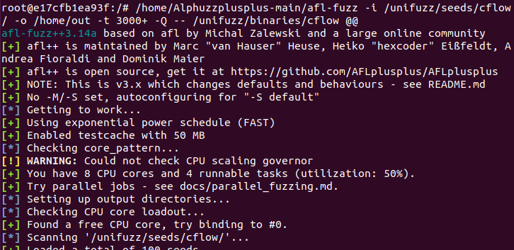
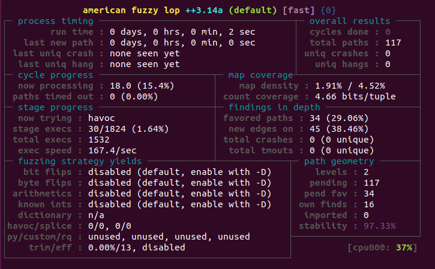

## ** docker image i386**

```bash
$ sudo docker pull yiruzhaozhao/alphuzz:i386artifact

$ sudo docker run --privileged -it yiruzhaozhao/alphuzz:i386artifact /bin/bash
```

We put the datasets binaries, Alphuzz and Alpuzzplusplus under the */* directory. 

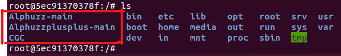


## **Example**
Take Unifuzz dataset for example.

### **Alphuzz**

```bash
$ /Alphuzz-main/afl-fuzz -i ./in -o ./out -Q -- /CGC/CROMU/CROMU_00001
```
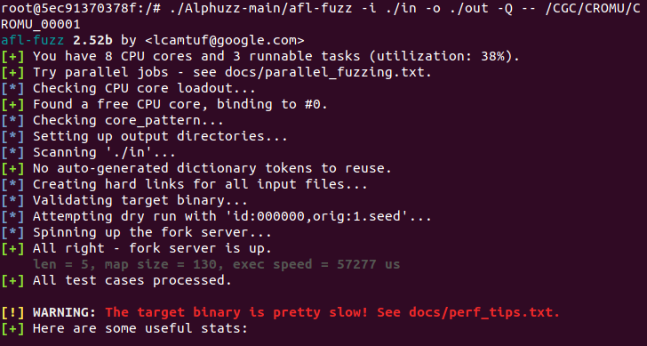

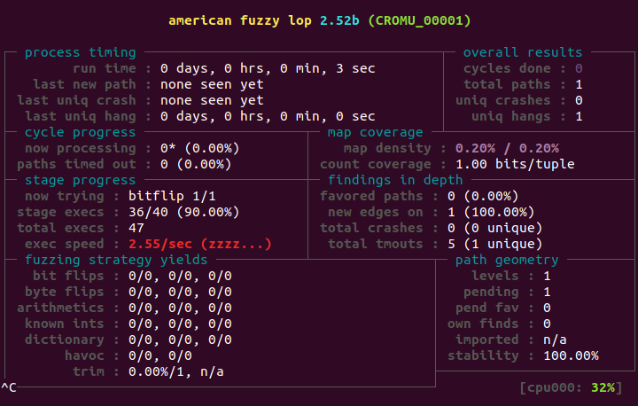

### **Alphuzzplusplus**

```bash
$ /Alphuzzplusplus-main/afl-fuzz -i ./in -o ./out -Q -- /CGC/CROMU/CROMU_00001
```
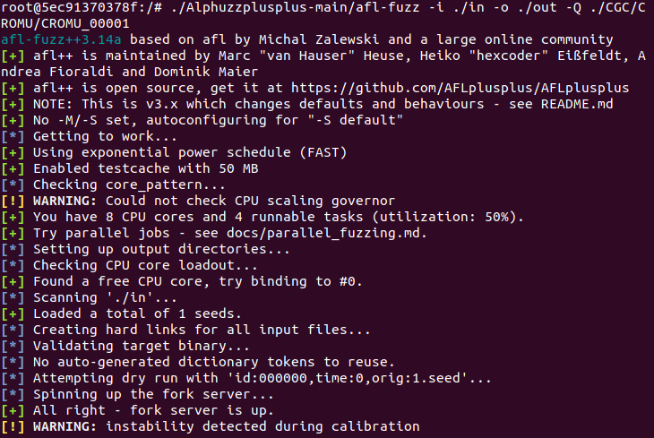

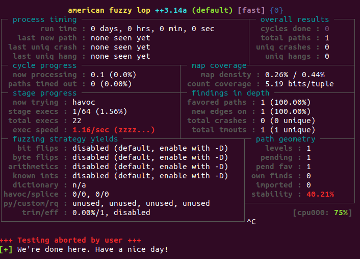
